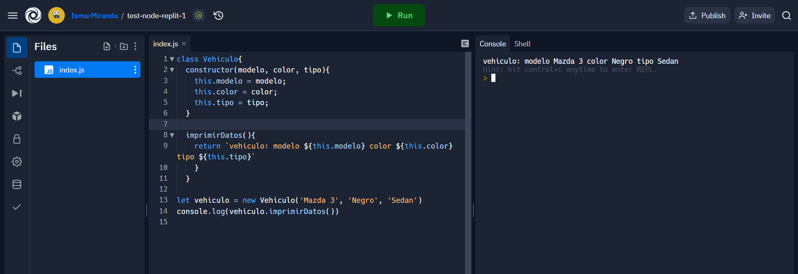
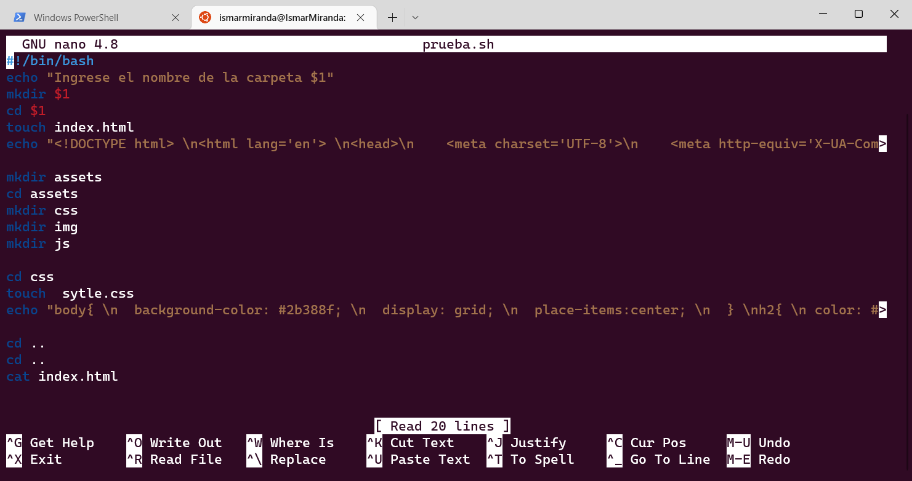

# **Resumen día 2 de pasantía**

## **Conocimos replit**

* ¿Qué es Replit?
    * ## es una plataforma ideal para programar, tanto si eres un programador experimentado como si estás dando tus primeros pasos en un lenguaje. Sus puntos fuertes son que no necesitarás instalar absolutamente nada ni pagar para utilizarla.

* ## Tambien hicimos un ejercicio con una clase vehículo

---

## **Conocimos la terminal y lo que podemos hacer dentro de ella como:**

* Crear Carpeta
* Mover carpetas
* Anexar contenido a un archivo
* Comandos basicos para mostrar archivos dentro de un directorio

---

### Creamos un script para ejecutar un programa con html, css y crear los directorios así como mostrar la pagina

