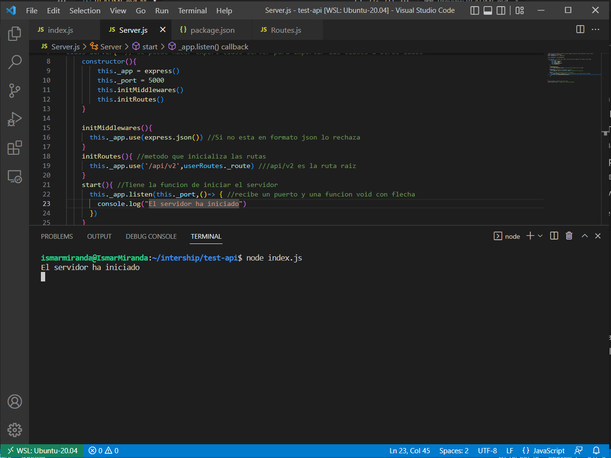
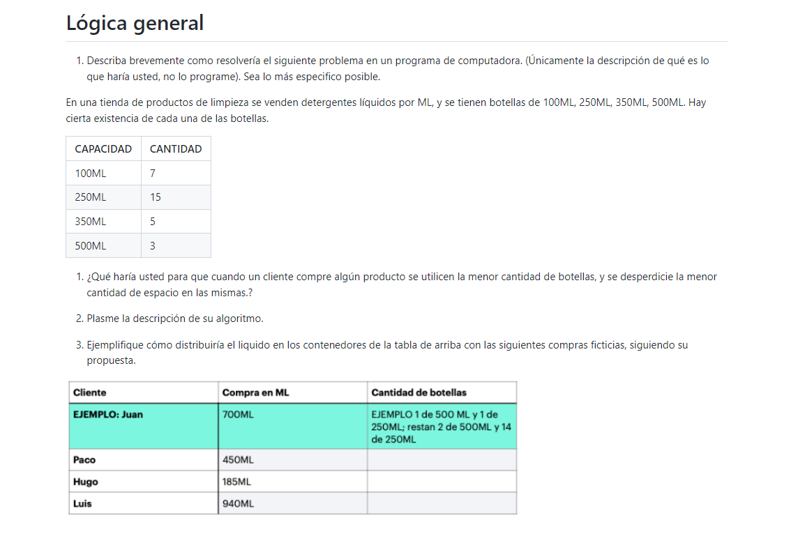

## Día 3 de pasantía         
---
## ¿Qué se hizo?

* ### Instalamos Postam 
    * ### Postman es una aplicación que nos permite realizar pruebas API. Es un cliente HTTP que nos da la posibilidad de testear 'HTTP requests' a través de una interfaz gráfica de usuario, por medio de la cual obtendremos diferentes tipos de respuesta que posteriormente deberán ser validados.

* Creamos una API basica con Nodejs y express 
    * ### Se crearon las rutas que tendrían los métodos básicos
        * #### POST
        * #### GET
        * #### PUT
        * #### DELETE
    * ### Se creo la clase Server
        * #### Se declaro el puerto
        * #### Un metodo que inicializa las rutas 
        * #### Una función que inicia el server

 

---
---

# EJERCICIO 1

## Solución

1. Solicitar la cantidad deseada
2. Verificar que la cantidad sea menor a la cantidad del stock
3. Tomar en cuenta solo las botellas que tengan existencia
4. Recorrer las botellas y comparar cual de ellas es la menor
5. En caso, la cantidad deseada sea mayor a las botellas, volvemos a comparar pero ir sumando botellas hasta llegar al valor indicado
6. A medida que se vayan utilizando botellas, ir descontando del stock

| capacidad  |   cantidad inicial  |	Cantidad final   |
|------------|---------------------|---------------------|
| 100 ml     |          7	       |	    4            |
|  250 ml	 |	        15		   |        14           |
|  350 ml	 |	        5		   |        4            |
|  500 ml	 |	        3		   |        0            |

 
| Cliente   |  compra en ML  |    Cant botellas       |
|-----------|----------------|------------------------|
|    Juan   |     700        |     1 500ml , 1 250ml  |	
|    Paco   |     450        |     1 500ml            |	
|    Hugo   |     185        |     2 100ml            |
|    Luis   |     940        |     1 500ml , 1 350ml , 1 100 ml               |		
---
---
# EJERCICIO 2 

Pasos del algoritmo
1. Solicitamos la lista con los nombres de los archivos
2. Recorremos la lista para encontrar los archivos con nombre repetido y la cantidad
3. Agregamos esos nombres de archivo y la cantidad de veces que se repite en una lista
2. tenemos un contador que será la cantidad de numero repetidos y nos servirá para enumerar los archivos
3. Recorremos la lista nuevamente, al primer repetido lo dejamos con el mismo nombre
4. al segundo repetido ya le ponemos nombreArchivo(cont+1) y así sucesivamente 
5. Imprimimos los archivos 