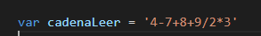
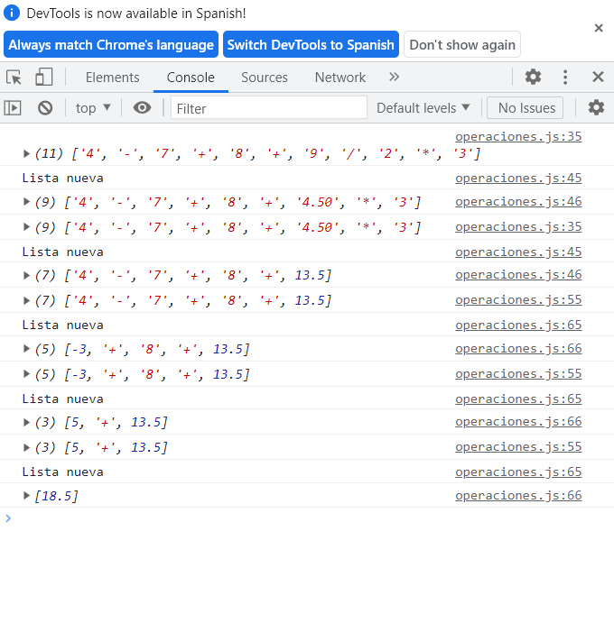

# **Logica y uso de lenguaje Javascript**

## **1. Proceso de descripcion**
### Para poder resolver este proyecto, primero debemos pedir la cadena. Despues de eso hacer un algoritmo que vaya tomando operaciones por jerarquia y luego ir haciendo más pequeña la lista

---
---
## **2. Pasos que realiza el programa**
### 1. Se solicita la cadena a ingresar
### 2. Se recorre la cadena caracter por caracter e irla juntando hasta que aparezca uno de esto singos: +,-,*,/
### 3. Realizar una jerarquía de operaciones la cual será (multiplicación, división, suma, resta)
### 4. Si encuentra una multiplicación o división primero hacerlo de izquierda a derecha
### 5. Ir haciendo la lista más pequeña a medida que se vayan haciendo las operaciones
### 6. Hasta quedarnos con la operacion final que será el resultado

---
---

## **Funcionamiento**
### Aquí es donde ingresamos la cadena con la operación a realizar

### Despues de ejecutar el HTML nos muestra esta imagen con el resultado de la operacion

